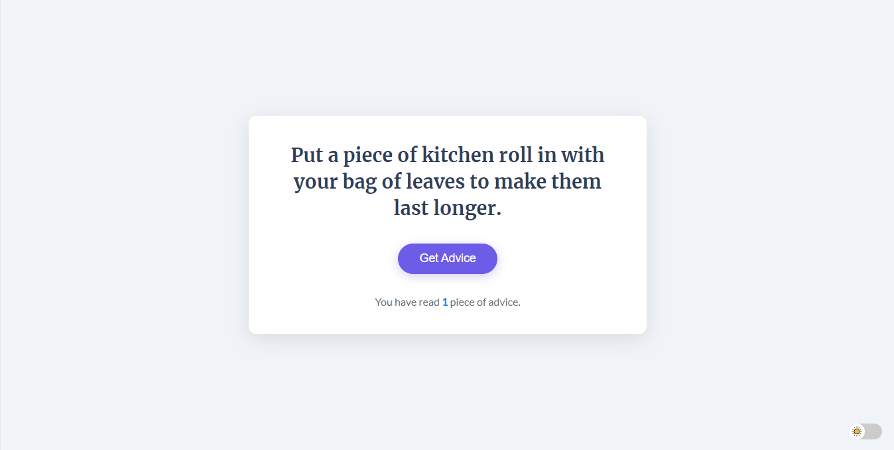
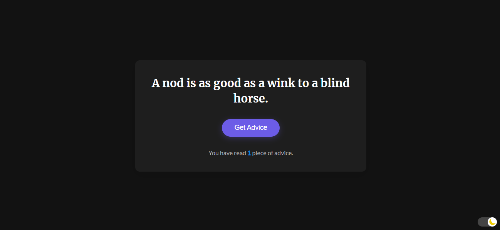

---

# Advice Generator - ReactJS Project

This project is a simple **Advice Generator** built using ReactJS, designed to randomly display pieces of advice to the user. The interface provides a clean and elegant look with a "Get Advice" button, which fetches a new random piece of advice upon each click.

## Features

- **Random Advice Generation**: The app generates a new piece of advice every time the "Get Advice" button is clicked.
- **Read Advice Count**: Tracks and displays the total number of advice pieces the user has read.
- **Dark Mode Toggle**: Provides a dark mode switch, allowing users to change the theme of the app.
- **Responsive Design**: The layout is designed to be responsive and works well across various screen sizes.

## Tech Stack

- **ReactJS**: The app is built using ReactJS.
- **CSS (Styled Components)**: Custom CSS is used for styling, ensuring a clean and elegant UI.
- **Font Integration**: A commercial-style font is used to enhance readability and provide a modern look to the advice text.

## Project Setup

### 1. Clone the Repository

```bash
git clone https://github.com/your-username/advice-generator.git
cd advice-generator
```

### 2. Install Dependencies

Before running the project, make sure to install all the required dependencies by running:

```bash
npm install
```

### 3. Start the Development Server

To run the application locally, execute the following command:

```bash
npm start
```

This will start the app on `localhost:3000`. Open your browser and navigate to `http://localhost:3000` to interact with the Advice Generator.

## File Structure

```bash
advice-generator/
├── public/
│   └── index.html           # Main HTML file
├── src/
│   ├── components/
│   │   └── AdviceBox.js      # Main advice generator component
│   ├── App.js                # Main app file
│   ├── App.css               # Styles for the app
│   └── index.js              # Entry point of the app
├── package.json              # Project dependencies
└── README.md                 # Project documentation`
```

## API Integration

The project uses a random advice API to fetch new advice upon each click. To change or integrate another advice API, simply modify the `getAdvice` function in `AdviceBox.js`.

## Dark Mode

The dark mode toggle is included on the bottom right of the app. Users can switch between light and dark themes, with the label aligned on the left of the toggle button to match the app’s theme.

## Screenshots

Here is a preview of the app interface:
[Demo Website](https://advice-generator-api-based.netlify.app)
### Light mode



### Dark Mode



## Future Enhancements

Some possible future improvements include:

- Adding more diverse advice categories (life, business, motivation, etc.).
- Implementing user authentication to track individual user advice history.
- Adding animations when advice is displayed or when switching between themes.
